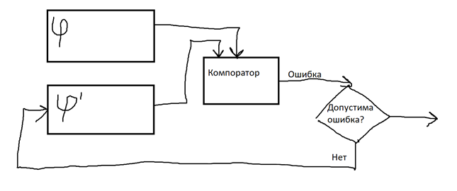
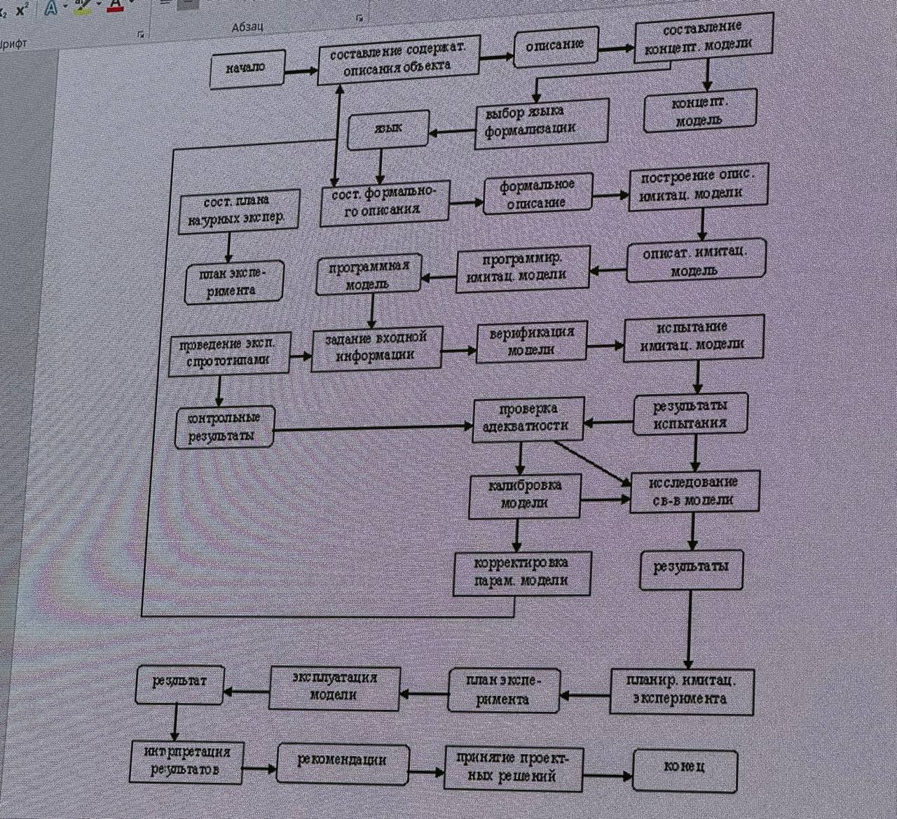
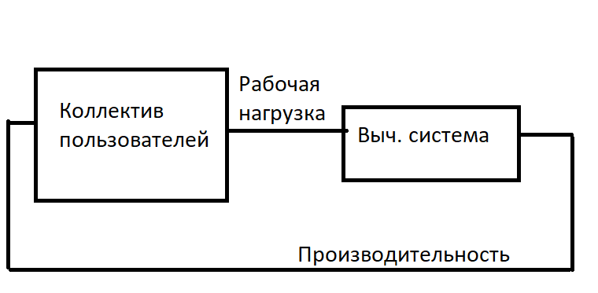

# Формализация и алгоритмизация процесса функционирования сложных систем

## Сущность компьютерного моделирования
Компьютерное моделирование сложных систем заключается в проведении на компьютере эксперимента с моделью.  
Это соответствует некоторому программному комплексу, который формально или алгоритмически описывает поведение элементов системы в процессе её функционирования.

---

## Основные требования к модели функционирования сложной системы

- **Полнота модели** – должна предоставлять пользователю возможность получения необходимого набора характеристик или оценок системы с требуемой точностью и достоверностью.  
- **Гибкость модели** – должна давать возможность воспроизведения различных ситуаций при варьировании структуры, алгоритмов и параметров модели.  
- **Блочная структура** – должна обеспечивать возможность добавления, изменения или удаления некоторых частей без вреда основной структуре.  
- **Машинная реализация** – должна соответствовать имеющимся техническим ресурсам.  

Процесс моделирования включает **разработку** и **компьютерную реализацию** и является **итерационным**.  
Этот процесс продолжается до тех пор, пока не будет получена модель, которую можно считать адекватной в рамках поставленной задачи.

---

## Основные этапы моделирования сложных систем

### 1. Построение концептуальной (описательной) модели и её формализация
Основная цель – переход от содержательного описания объекта к его математической модели.  
Это наиболее ответственный и наименее формализованный шаг.  

**Последовательность действий:**
1. Проведение границы между системой и внешней средой.  
2. Исследование объекта с точки зрения выделения основных процессов функционирования системы по отношению к цели моделирования.  
3. Переход от содержательного описания системы к формализованному описанию её свойств (исключение второстепенных элементов).  
4. Определение элементов модели:  
   - **Блоки 1-й группы** – имитатор воздействия внешней среды.  
   - **Блоки 2-й группы** – модель функционирования системы.  
   - **Блоки 3-й группы** – вспомогательные (реализация первых двух групп, обработка результатов).  
5. Разбиение процесса функционирования системы на подпроцессы так, чтобы построение их моделей было элементарным (сведение к типовым математическим моделям).  

---

### 2. Алгоритмизация модели и её компьютерная реализация
Математическая модель воплощается в конкретную компьютерную.  

**Исходная информация** – IDEF0.  

**Последовательность действий:**
1. Разработка схемы алгоритма.  
2. Разработка программы.  
3. Выбор технических средств для реализации компьютерной модели.  
4. Программирование модели.  
5. Отладка программы.  
6. Проверка программы на тестовых данных.  
7. Документирование по всему этапу.  

---

### 3. Интерпретация полученных результатов моделирования
Проведение рабочих расчётов по готовой программе. Они показывают работоспособность программы.  

**Последовательность действий:**
1. Планирование машинного эксперимента с моделью (активный и пассивный эксперимент).  
   - Составление плана эксперимента с указанием комбинаций переменных и параметров.  
   - Выделение факторов.  
   - Главная задача – получить максимальный объём информации об объекте моделирования при минимальных затратах вычислительных ресурсов.  
2. Контрольная калибровка модели.  

---

## Ошибки моделирования

- **Ошибка формализации** – необходимо полностью переделывать модель.  
- **Ошибка решения** – выбран некорректный или слишком упрощённый метод построения модели.  
- **Ошибка задания параметров модели**.  

---

## Проверка адекватности модели

Проверка адекватности заключается в анализе её соразмерности и равнозначности системе.  
Адекватность нарушается из-за:  
- идеализации внешних условий и режимов функционирования,  
- пренебрежения случайными факторами.  

Простейшая мера адекватности – отклонение характеристик объекта от их модели.  
Считается, что модель адекватна системе, если вероятность того, что отклонение характеристики не превышает некоторую величину, больше допустимой вероятности.  
Однако этого недостаточно, так как система оценивается не по одной характеристике, а по многим.  

Оценка проводится **экспертным анализом** (человеком или системой).  

**Типы проверок:**
- Проверка внешних воздействий.  
- Проверка собственных математических моделей в среде.  
- Проверка концептуальной модели.  
- Проверка способов измерения и вычисления выходных характеристик.  
- Программная проверка.  

---

## Изменения в модели

- **Глобальные** – концептуальные или математические модели.  
- **Локальные** – уточнение параметров или алгоритмов.  
- **Параметрические** – варьирование некоторых специальных параметров.  

---

## Завершение этапа
Этап интерпретации завершается **определением и фиксацией области пригодности модели** – множества условий, при которых точность результатов моделирования находится в допустимых пределах.  

---

## Схема взаимосвязи технических этапов моделирования


# Уровни моделирования для анализа вычислительной системы

1. **Структурный уровень** (Процессор, память) – исследование программного обеспечения (системы массового обслуживания)
2. **Функционально-логический уровень проектирования** (моделирование автоматов), разбивается на:
   - a) Регистровая передача  
   - b) Логический уровень (опускаемся до уровня вентилей, все моделируем в этом уровне)
3. **Схемо-технический уровень** (на уровне транзисторов и др., используется система дифференциальных уравнений)
4. **Конструктивный уровень** (главный вопрос – отведение тепла, сложнейшие мат. уравнения по теплоотводности)

> 💡 Главное – блочно-ориентированный подход.  
> Разделение на функциональное моделирование, алгоритмическое проектирование, конструкторское проектирование и технологическое.

При моделировании новых и модернизации действующих вычислительных систем и сетей необходимо **предварительно проводить анализ функционирования**, с учетом различных вариантов структурной организации.  
Эти варианты могут отличаться:
- составом и характеристиками моделей (устройств)
- структурой межмодульных связей
- режимами работы
- алгоритмами управления

Под вычислительной системой будем понимать **комплекс аппаратных и программных средств**, которые в совокупности выполняют определенные рабочие функции.

- **Аппаратные средства** – ЦП, оперативная память, периферийные устройства и т.д.  
- **Программные средства** – ОС (набор ручных и автоматических процедур, позволяющих эффективно использовать вычислительную установку)

Множество входных сигналов на систему называется **рабочая нагрузка**.



---

## Индекс производительности

Используется для представления производительности системы. Различают:  

- **Качественные индексы** – экспертная оценка  
- **Количественные индексы**:  
  - Пропускная способность (объем информации, обрабатываемый за единицу времени)  
  - Время реакции (интервал между входной и выходной информацией)  
  - Коэффициент использования оборудования (отношение времени использования к общему интервалу времени)

---

## Концептуальная модель описания системы

Включает:  
- информацию о выходных параметрах системы  
- структуру  
- особенности работы каждого элемента  
- характер взаимодействия между ресурсами  

Типовая математическая схема – **система массового обслуживания**.

---

## Основные задачи

1. Определение принципов организации вычислительной системы  
2. Выбор архитектуры  
3. Уточнение функций вычислительной системы  
4. Декомпозиция функций (на аппаратный и программный уровни)  
5. Разработка архитектурной схемы  
6. Определение выходных параметров устройств и формирование ТЗ на разработку устройств более низкого уровня  

Особенность этих систем – работа со **случайными элементами потока**.

---

# Лабораторная работа 1

## Генерация таблицы случайных чисел

- Табличный способ  
- Алгоритмический способ  

Пример (фрагмент):  

| 1-разрядный | 2 | 3 | 1 | 2 | 3 |
|-------------|---|---|---|---|---|
| ...         | … | … | … | … | … |

Последняя строка будет **количественно определять случайность** метода.  
Также справа будет введено 10 цифр вручную — система должна вычислить случайность этого метода.  
> Требуется разработать критерий случайности или метод проверки.

---

# Теория моделирования: два потока

Заявки **wi** поступают в очередь, потом в обслуживающий аппарат (для *i*-ого прибора).  

В любом элементарном акте обслуживания можно выделить:  
1. Ожидание обслуживания заявки  
2. Обслуживание заявки  

*i*-ый прибор обслуживания состоит из:  
- **накопителя заявок** (ёмкость Li: от 0 до максимальной)  
- **канала обслуживания** (обслуживающий аппарат)  

Обозначение: **Yi** – то, что сразу поступает в канал.

---

## Потоки событий

- **Поток событий** – последовательность событий, происходящих в случайные моменты времени  
- **Однородный поток** – характеризуется только моментами наступления событий  
- **Неоднородный поток** – задается моментами и набором признаков (например, приоритет)  
- **С ограниченным последействием** – интервалы независимы и случайны  
- **Ординарный поток** – вероятность более 1 события на малом интервале ≈ 0  
- **Стационарный поток** – зависит только от длины интервала, но не от его положения  

Формула:  

```
Lim(Δt→0) (P1(t, Δt) / Δt) = λ(t)
```

---

## Q-схемы

Процесс функционирования *i*-ого прибора = процесс изменения состояний его элементов во времени.  

Вектор состояний:  
1. Состояние накопителя (0 – пуст, >0 – число заявок)  
2. Состояние канала (0 – свободен, 1 – занят)  

Примеры:  
- Параллельное многоканальное обслуживание – МФЦ, кассы в магазине  
- Последовательное (многофазовое) – этапы последовательной обработки  

### Разомкнутые и замкнутые Q-схемы
- **Разомкнутые** – выходной поток не возвращается во вход  
- **Замкнутые** – есть связь вход-выход  

### Параметры Q-схемы
1. Количество фаз  
2. Количество каналов в каждой фазе  
3. Количество накопителей каждой фазы  
4. Емкость i-ого накопителя  

Если:  
- Li = 0 → система с потерями  
- Li = ∞ → система с ожиданием  
- 0 < Li < ∞ → смешанная система  

### Алгоритм функционирования Q-схемы
Учитывает правила поведения заявок.  
Приоритеты: статические, динамические, относительные, абсолютные.

Формальная запись:  

```
Q = (w, U, H, Z, R, A)
```

где:  
- w – множество входных потоков  
- U – подмножество потоков обслуживания  
- R – оператор сопряжения  
- H – собственные параметры  
- Z – множество состояний  
- A – алгоритмы обслуживания заявок

# Математическое описание функционирования Q-схем

Для получения соотношений, связывающих функционирование **Q-схем**, вводятся некоторые **допущения** относительно:

- входных потоков  
- функций распределения  
- плотности распределения  
- длительностей обслуживания запросов  
- дисциплин обслуживания  

---

## Марковские случайные процессы

Для математического описания функционирования устройств, развивающихся в форме случайного процесса, используется **математический аппарат теории вероятностей** — в частности, **марковские случайные процессы**.

> 🎯 **Марковский процесс** — случайный процесс, в котором вероятность будущего состояния системы зависит **только от её текущего состояния**,  
> и **не зависит от истории** (того, как система пришла в это состояние).

---

## Уравнения Колмогорова

Для марковского процесса составляют **уравнения Колмогорова**.  
В общем виде:

```
F(P'(t), P(t), λ) = 0
```

где λ — набор коэффициентов.

Для **стационарного распределения**:

```
F(P(t), λ) = 0
P = P(λ)
Y = Y(P(λ))
```

> Последнее выражение описывает **зависимость выходных параметров модели** от **внутренних параметров** — это **базисная модель**.

---

## Интерфейсная модель

Необходимо установить зависимость внутренних параметров модели λ  
от конструктивных параметров **X**, неуправляемых параметров **V**  
и внутренних параметров **H**:

```
λ = λ(X, V, H)
```

Так возникает **интерфейсная модель**.

> 💡 Математическая модель строится как совокупность **базисной** и **интерфейсной** моделей.  
> Это позволяет использовать одну и ту же базисную модель для различных задач моделирования,  
> просто **параметрически настраивая** её под конкретные условия.

---

## Цель математической модели Q-систем

Математическая модель Q-системы должна обеспечивать вычисление:

- **времени реакции** на запрос  
- **производительности** системы  


---

## Вероятностный анализ состояний

Пусть **S** — множество всех возможных состояний,  
а **λᵢⱼ** — плотность вероятностей переходов между ними.  

Найдем вероятность **P₁(t)** — вероятность того, что в момент *t* система будет находиться в состоянии *S₁*.

Пусть время увеличивается на малое приращение Δt. Тогда возможны два варианта:

1. В момент *t* система уже была в состоянии *S₁* и **не покинула** его за Δt.  
2. В момент *t* система была в состоянии *S₃* и **перешла** в *S₁* за Δt.

Вероятность 1-го случая:

```
P₁(t) * (1 - λ₁₂ * Δt)
```

Вероятность 2-го случая:

```
P₃(t) * λ₃₁ * Δt
```

Итого:

```
P₁(t + Δt) = P₁(t) * (1 - λ₁₂ * Δt) + P₃(t) * λ₃₁ * Δt
```

Переходя к пределу при Δt → 0:

```
dP₁(t)/dt = -P₁(t) * λ₁₂ + P₃(t) * λ₃₁
```

> Это и есть **первое уравнение Колмогорова**.

---

## Система уравнений Колмогорова

```
P₁'(t) = -P₁(t) * λ₁₂ + P₃(t) * λ₃₁
P₂'(t) = -P₂(t) * λ₂₄ - P₂(t) * λ₂₃ + P₄(t) * λ₄₂ + P₁(t) * λ₁₂
P₃'(t) = -P₃(t) * λ₃₄ - P₃(t) * λ₃₁ + P₂(t) * λ₂₃
P₄'(t) = -P₄(t) * λ₄₂ + P₂(t) * λ₂₄ + P₃(t) * λ₃₄
```

Интегрирование этой системы даёт вероятности состояний как функции времени.  
Начальные условия зависят от исходного состояния системы.  

> 🔹 Сумма всех вероятностей должна быть равна **1**.  
> 🔹 Знак каждого члена в правой части уравнения зависит от направления стрелки перехода:  
> если стрелка выходит из состояния — знак минус, если входит — плюс.  
> Каждый член равен произведению **интенсивности перехода** на **вероятность исходного состояния**.


---

## Многоканальная система массового обслуживания с отказом

Рассмотрим систему, где состояние определяется числом занятых каналов:

| Состояние | Описание |
|------------|-----------|
| S₀ | все каналы свободны |
| S₁ | занят один канал |
| Sₖ | занято k каналов |
| Sₙ | заняты все каналы |

Переходы слева направо соответствуют потоку **заявок**,  
а справа налево — потоку **обслуживания**.

Уравнение для вероятности состояния:

```
P'(k) = -P(k) * k * μ - P(k) * λ + P(k-1) * λ + μ * P(k+1) * (k + 1)
```


Дополнительно:

```
Q = 1 - Pₙ
A = λ * Q
```

где:  
- **Q** — вероятность обслуживания без отказа  
- **A** — среднее число заявок, обслуженных в единицу времени  

> Полученные соотношения формируют **базисную модель оценки производительности**.  
> Параметр **λ** (1/время решения) — усреднённая характеристика нагрузки,  
> параметр **μ** — характеристика оборудования и решаемой задачи.

Если время ввода-вывода мало по сравнению с временем решения,  
можно принять:

```
1/μ = среднее время решения задачи
```

---

# Лабораторная работа 2

## Цель

Определить **время нахождения системы в каждом состоянии** при установившемся режиме.

## Условие

Есть сложная система **S** с числом состояний ≤ 10.  
Функционирование описывается **матрицей переходов** между состояниями.

- строки и столбцы — состояния S₁…S₁₀  
- на пересечении — интенсивности переходов (λ ≥ 0)  
- число состояний задаётся вручную  

Необходимо определить **время пребывания в каждом состоянии** при установившемся режиме.

> ⚠️ Время ≠ вероятность!  
> Установившееся состояние — когда все Pₙ' = 0 (вероятности становятся постоянными).

## Вывод программы

Под основной матрицей (например, 3×3) выводятся 3 строки:

| Состояние | Время | Вероятность |
|------------|--------|-------------|

> Сумма всех вероятностей должна быть **равна 1**.  
> Начальное состояние выбирается произвольно.

---

📘 *Конец лабораторной работы №2*
